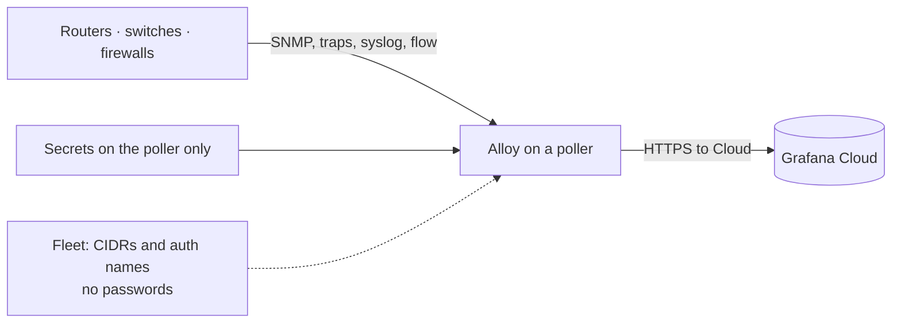

# Grafana Network O11y Guide

Stand up **network observability in Grafana Cloud** with one collector on a Linux poller: SNMP, traps, syslog, and NetFlow / sFlow.

This is written for **network engineers**. You do not need a Grafana SE, and you do not need to be a software developer. If a word is new, see [docs/glossary.md](docs/glossary.md).

This is **not** an official Grafana product repo. The extra SNMP / trap / flow pieces are not in the public Alloy package yet — [docs/install-alloy.md](docs/install-alloy.md) shows how to install them.

## What you are building

A Linux host on the **management network** (same VLAN or VRF as device SNMP, traps, syslog, and flow exporters). Grafana Alloy runs there as a normal systemd service.

| Your devices send / answer | Alloy does | You see in Grafana Cloud |
|----------------------------|------------|---------------------------|
| SNMP (UDP 161) | Discovers IPs in a CIDR, then polls | CPU, interfaces, BGP, … (`snmp_*`) |
| SNMP traps | Listens (sample uses UDP 11620) | Logs `{service_name="alloy-snmptrap"}` |
| Syslog | Listens (sample uses UDP 1514) | Logs `{service_name="alloy-syslog"}` |
| NetFlow / IPFIX / sFlow | Listens (2055 / 6344) | Flow metrics (`rate(…alloy_network_io_by_flow_bytes…)`) |

Point trap / syslog / flow **destinations on the devices** at this poller’s management IP and those ports.

**Grafana Cloud Fleet Management** is how you edit that non-secret config from a **central UI** (CIDRs, auth *names*, listen ports) with version history — one poller or many. **Communities, SNMPv3 passwords, and the Cloud token never go in Fleet.** Details: [docs/secrets.md](docs/secrets.md).



If Alloy polls `10.1.1.5` as `core-01`, traps and flows from `10.1.1.5` get the same name. Servers you do not SNMP-poll show up as IPs. That is expected.

## Prerequisites

- A Linux host that can **ping and `snmpget`** the devices. If that fails from the host, Alloy will fail too.
- A Grafana Cloud login and a **stack** you can open. How to copy the three push settings (URL, numeric instance ID, `glc_` token): **[docs/grafana-cloud-otlp.md](docs/grafana-cloud-otlp.md)**. You will not find these in a welcome email.
- **Docker** on the machine that *builds* Alloy (the poller or a jump box). You copy the finished program onto the poller. You do not need to write Go.

## Quickstart

**1. Install the official Alloy service** so Linux has `/etc/alloy/` and `systemctl start alloy`. Debian / Ubuntu:

```
sudo mkdir -p /etc/apt/keyrings
sudo wget -O /etc/apt/keyrings/grafana.asc https://apt.grafana.com/gpg-full.key
sudo chmod 644 /etc/apt/keyrings/grafana.asc
echo "deb [signed-by=/etc/apt/keyrings/grafana.asc] https://apt.grafana.com stable main" | sudo tee /etc/apt/sources.list.d/grafana.list
sudo apt-get update && sudo apt-get install alloy
```

Other distros: [Install Alloy on Linux](https://grafana.com/docs/alloy/latest/set-up/install/linux/).

That package is the **service and file layout**. It cannot run this guide’s SNMP discovery / trap / flow samples yet. Next: **[docs/install-alloy.md](docs/install-alloy.md)** (clone, Docker build, replace `/usr/bin/alloy`, copy the SNMP library). Then in `/etc/default/alloy` (RHEL: `/etc/sysconfig/alloy`):

```
CUSTOM_ARGS="--stability.level=experimental"
```

Without that line, Alloy will refuse the network pieces even after you replace the program.

**2. Cloud credentials on the poller, not in Fleet.** Copy them from Grafana Cloud using [docs/grafana-cloud-otlp.md](docs/grafana-cloud-otlp.md) (grafana.com → your stack → **OpenTelemetry** → **Configure**). Add to the same file (`/etc/default/alloy`):

```
GC_OTLP_URL=https://otlp-gateway-prod-<region>.grafana.net/otlp
GC_OTLP_ACCOUNT=123456
GC_OTLP_KEY=glc_…
```

Do not open `GC_OTLP_URL` in a browser (it is a push API, not a website).

**3. SNMP credentials on the poller.** A file only root can read. Easiest first time: `snmp-discovery init` writes `/etc/alloy/auths.yml` (it asks for the community or v3 user, or take flags). Copy the example instead if you prefer to edit YAML by hand. Details: [docs/secrets.md](docs/secrets.md).

```
sudo snmp-discovery init --out-auths /etc/alloy/auths.yml --out-discovery /tmp/discovery.yml
```

Each block has a **name** (`public_v2`, `dc_v3`). Config and Fleet refer to that name only. Other stores (Vault, and so on): [docs/secrets.md](docs/secrets.md).

**4. Tell Alloy what to scan.** Two ways:

- **Local file (simplest first time):** copy [`alloy/config.alloy.sample`](alloy/config.alloy.sample) to `/etc/alloy/config.alloy`. `cidrs` and `auths` are lists — put every prefix and every credential **name** you use:

```alloy
  group {
    name  = "hq"
    cidrs = ["10.0.0.0/24", "10.0.1.0/24"]           // one box: add "192.168.1.1/32"
    auths = ["public_v2", "campus_v2"]                // names from auths.yml
  }
```

- **Fleet (central UI + version control):** Grafana Cloud → **Connections → Collector → Fleet Management → add collector**. Paste the snippet it gives you into `/etc/alloy/config.alloy`. Edit CIDRs and auth *names* in the Fleet pipeline from then on — never communities. Sample: [`alloy/fleet-pipeline.alloy.sample`](alloy/fleet-pipeline.alloy.sample). More: [docs/fleet.md](docs/fleet.md). Use this whenever you want Cloud to own the config, including a single poller.

**5. Start the service.**

```
sudo systemctl enable --now alloy
sudo systemctl restart alloy
```

After you change `/etc/alloy/config.alloy`:

```
sudo systemctl reload alloy
```

Logs: `journalctl -u alloy -f`. Local health page (on the poller, not Cloud): http://127.0.0.1:12345

On each device, set trap / syslog / flow export to **this host’s management IP** and the ports in the config (samples: traps `11620`, syslog `1514`, NetFlow `2055`, sFlow `6344`).

**6. Import the dashboards.** While you do this, the first SNMP polls should already be landing in Cloud.

In Grafana Cloud: left menu → **Dashboards** → **New** → **Import**. Upload each JSON file in [`dashboards/`](dashboards/) (see [docs/dashboards.md](docs/dashboards.md)). When asked, pick this stack’s Prometheus and Loki data sources.

Open **Device Summary** first, then **Health**. Time range **Last 1 hour**. Devices and scrapes should start filling in. Empty panels: [troubleshooting/bring-up.md](troubleshooting/bring-up.md). You do not need Explore to finish bring-up.

## Optional: Docker Compose

If you prefer containers to systemd, the same image can run under Compose. Build it first ([install-alloy.md](docs/install-alloy.md) step 2). Docker’s default bridge often **cannot** reach a campus management VLAN — on Linux set `network_mode: host` in `compose.yaml`, or run Compose on a host that already sits on that network.

```
cp .env.sample .env
cp alloy/config.alloy.sample alloy/config.alloy
# secrets: snmp-discovery init --out-auths alloy/auths.yml
#   (or cp alloy/auths.example.yml alloy/auths.yml and edit)
# then edit .env (GC_OTLP_*) and the cidrs / auths lists in config.alloy
docker compose up -d
```

## More detail

- **[docs/glossary.md](docs/glossary.md)** — Alloy, Fleet, Explore, PromQL, …
- **[docs/grafana-cloud-otlp.md](docs/grafana-cloud-otlp.md)** — where to copy URL, instance ID, and token
- **[docs/install-alloy.md](docs/install-alloy.md)** — replace the official program with the network build
- **[docs/architecture.md](docs/architecture.md)** — discovery, poll intervals, naming
- **[docs/scalability.md](docs/scalability.md)** — when to add a poller, SNMP shards, Cloud cardinality
- **[docs/availability.md](docs/availability.md)** — what dies with the poller; site split, VIP, why two Alloy is not HA
- **[docs/fleet.md](docs/fleet.md)** — Fleet vs files on the poller
- **[docs/secrets.md](docs/secrets.md)** — where communities and tokens live
- **[docs/dashboards.md](docs/dashboards.md)** — import the A0–A4 set (this is how you confirm data)
- **[docs/grafana.md](docs/grafana.md)** — Explore queries only if a panel stays empty
- **[troubleshooting/bring-up.md](troubleshooting/bring-up.md)** — first-time failures
- **[troubleshooting/snmp.md](troubleshooting/snmp.md)** — `snmpget` from the poller

# Contact

Issues and PRs here, or marcnetterfield@gmail.com
