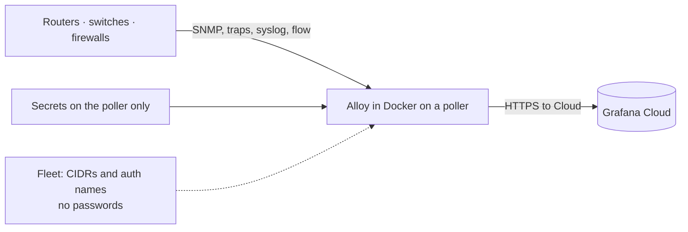

# Grafana Network O11y Guide

Stand up **network observability in Grafana Cloud** with one collector on a Linux poller: SNMP, traps, syslog, and NetFlow / sFlow.

This is written for **network engineers**. You do not need a Grafana SE, and you do not need to be a software developer. If a word is new, see [docs/glossary.md](docs/glossary.md).

This is **not** an official Grafana product, and there is **no support SLA**. Issues and PRs here, or the contact at the bottom. The extra SNMP / trap / flow pieces are not in Grafana’s `apt`/`yum` Alloy package yet. You run a **public Docker image** ([`ghcr.io/mesverrum/alloy-network`](https://github.com/Mesverrum/grafana-network-o11y-guide/pkgs/container/alloy-network)) — personal GHCR namespace, not `grafana/alloy`. Compile only if you want to rebuild: [docs/install-alloy.md](docs/install-alloy.md).

## Read this before you start

| Expect this | Not this |
|-------------|----------|
| **Linux Docker** on a host that can **ping and `snmpget`** the CIDR | Docker Desktop on a laptop that cannot see the management VLAN |
| **Your** Grafana Cloud stack (URL, instance ID, `glc_` token with **metrics:write** and **logs:write**) | A shared demo stack, or the dashboard URL as `GC_OTLP_URL` |
| First pass = SNMP + **Health** + **Device Summary** | Flow / trap / syslog boards filling in with no device export |
| Local `alloy/config.alloy` the first time | Fleet on day one — the OpenTelemetry token usually **cannot** write Fleet |
| Communities / v3 in `alloy/auths.yml`, Cloud token in `.env` | Passwords pasted into Fleet |
| Fingerprinters + vendor OIDs from the image, or a [local overlay](docs/install-alloy.md#optional-overlay-fingerprinters--modules) | Mixing a new `fingerprinters.yml` with an old `snmp-network.yml` |
| Device Details util / error / memory % after you [import recording rules](docs/recording-rules.md) | Those panels lighting up from SNMP scrape alone |

Point trap / syslog / flow destinations at this poller only when you want those boards. SNMP-only is a valid first pass.

`apt install alloy` is **not** the first step. Use that later only if you want Alloy as a host systemd service ([install-alloy.md](docs/install-alloy.md#optional-run-as-a-host-service)).

## What you are building

A Linux host on the **management network** (same VLAN or VRF as device SNMP, traps, syslog, and flow exporters). Alloy runs in Docker with **host networking** so it uses that host’s IPs.

| Your devices send / answer | Alloy does | You see in Grafana Cloud |
|----------------------------|------------|---------------------------|
| SNMP (UDP 161) | Discovers IPs in a CIDR, then polls | CPU, interfaces, BGP, … (`snmp_*`) |
| SNMP traps | Listens (sample uses UDP 11620) | Logs `{service_name="alloy-snmptrap"}` |
| Syslog | Listens (sample uses UDP 1514) | Logs `{service_name="alloy-syslog"}` |
| NetFlow / IPFIX / sFlow | Listens (2055 / 6344) | Flow metrics (`rate(…alloy_network_io_by_flow_bytes…)`) |

When you want those last three rows, point device destinations at this poller’s management IP and the sample ports. **Grafana Cloud Fleet Management** is optional later: edit CIDRs and auth *names* from a central UI. **Communities, SNMPv3 passwords, and the Cloud token never go in Fleet.** Details: [docs/secrets.md](docs/secrets.md).



If Alloy polls `10.1.1.5` as `core-01`, traps and flows from `10.1.1.5` get the same name. Servers you do not SNMP-poll show up as IPs. That is expected.

## Prerequisites

- A **Linux** host that can **ping and `snmpget`** the devices. If that fails from the host, Alloy will fail too. Docker Desktop on Mac/Windows is not this path.
- Docker Engine + Compose on that host (`docker compose version`).
- A Grafana Cloud login and **your** stack. How to copy the three push settings: **[docs/grafana-cloud-otlp.md](docs/grafana-cloud-otlp.md)**.

## Quickstart

**1. Clone this repo on the poller.**

```
git clone https://github.com/Mesverrum/grafana-network-o11y-guide.git
cd grafana-network-o11y-guide
```

**2. Cloud credentials in `.env`, not in Fleet.** Copy them using [docs/grafana-cloud-otlp.md](docs/grafana-cloud-otlp.md) (grafana.com → your stack → **OpenTelemetry** → **Configure**):

```
cp .env.sample .env
```

Edit `.env`:

```
GC_OTLP_URL=https://otlp-gateway-prod-<region>.grafana.net/otlp
GC_OTLP_ACCOUNT=123456
GC_OTLP_KEY=glc_…
ALLOY_IMAGE=ghcr.io/mesverrum/alloy-network:v0.1.0
```

Do not open `GC_OTLP_URL` in a browser (it is a push API, not a website). Leave `ALLOY_IMAGE` as that tag unless you [compiled](docs/install-alloy.md#optional-compile-from-source).

**3. SNMP credentials.** Copy the example and put your communities / v3 in. Details: [docs/secrets.md](docs/secrets.md).

```
cp alloy/auths.example.yml alloy/auths.yml
chmod 600 alloy/auths.yml
```

Each block has a **name** (`public_v2`, `dc_v3`). Config refers to that name only.

**4. Tell Alloy what to scan.** Copy the sample (do this *before* `compose up` — if the file is missing, Docker creates a directory with that name):

```
cp alloy/config.alloy.sample alloy/config.alloy
```

Edit the `cidrs` and `auths` lists:

```alloy
  group {
    name  = "hq"
    cidrs = ["10.0.0.0/24", "10.0.1.0/24"]           // one box: add "192.168.1.1/32"
    auths = ["public_v2", "campus_v2"]                // names from auths.yml
  }
```

Fleet is later and optional ([docs/fleet.md](docs/fleet.md)). Skip it on the first install.

**5. Start Alloy.**

```
docker compose up -d
docker compose logs -f --tail=80
```

`compose.yaml` uses `network_mode: host` so SNMP and UDP listeners share the poller’s interfaces. Local health page (on the poller, not Cloud): http://127.0.0.1:12345

After you change `alloy/config.alloy` or `alloy/auths.yml`:

```
docker compose up -d --force-recreate
```

On each device, set trap / syslog / flow export to **this host’s management IP** and the sample ports (`11620`, `1514`, `2055`, `6344`) — only if you want those boards. Until a device exports, Flow / trap / syslog panels stay empty; that is expected.

**6. Import the dashboards.** While you do this, the first SNMP polls should already be landing in Cloud.

In Grafana Cloud: left menu → **Dashboards** → **New** → **Import**. Upload each JSON file in [`dashboards/`](dashboards/) (see [docs/dashboards.md](docs/dashboards.md)). When asked, pick this stack’s Prometheus and Loki data sources.

Open **Device Summary** first, then **Health**. Time range **Last 1 hour**. Devices, discovery counts, and scrapes should start filling in. Then import [recording rules](docs/recording-rules.md) so Device Details util / error / memory % can fill. Empty panels: [troubleshooting/bring-up.md](troubleshooting/bring-up.md). You do not need Explore to finish bring-up.

## More detail

- **[docs/glossary.md](docs/glossary.md)** — Alloy, Fleet, Explore, PromQL, …
- **[docs/grafana-cloud-otlp.md](docs/grafana-cloud-otlp.md)** — where to copy URL, instance ID, and token
- **[docs/install-alloy.md](docs/install-alloy.md)** — image tags, overlay fingerprinters, compile, or host systemd
- **[docs/architecture.md](docs/architecture.md)** — discovery, poll intervals, naming
- **[docs/overrides.md](docs/overrides.md)** — pin a reskinned Linux / generic sysObjectID to modules (ktranslate-style)
- **[docs/scalability.md](docs/scalability.md)** — when to add a poller, SNMP shards, Cloud cardinality
- **[docs/availability.md](docs/availability.md)** — what dies with the poller; site split, VIP, why two Alloy is not HA
- **[docs/fleet.md](docs/fleet.md)** — Fleet vs files on the poller
- **[docs/secrets.md](docs/secrets.md)** — where communities and tokens live
- **[docs/dashboards.md](docs/dashboards.md)** — import the A0–A4 set (this is how you confirm data)
- **[docs/recording-rules.md](docs/recording-rules.md)** — import Cloud rules so Device Details util / error / memory % fill
- **[docs/grafana.md](docs/grafana.md)** — Explore queries only if a panel stays empty
- **[troubleshooting/bring-up.md](troubleshooting/bring-up.md)** — first-time failures
- **[troubleshooting/snmp.md](troubleshooting/snmp.md)** — `snmpget` from the poller

# Contact

Issues and PRs here, or marcnetterfield@gmail.com
