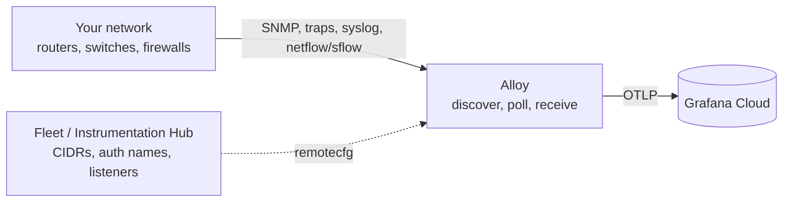

# Grafana Network O11y Guide

A quick, working example of **network observability in Grafana Cloud** using [Grafana Alloy](https://grafana.com/docs/alloy/latest/) as the collector — SNMP, traps, syslog, and NetFlow/sFlow — without a sidecar like ktranslate.

This repo is a **how-to**, not the bits that build the collector. Bugs in discovery belong in [snmp-sd](https://github.com/Mesverrum/snmp-sd). Bugs in Alloy components belong in [grafana/alloy](https://github.com/grafana/alloy) (or the [network-snmp fork](https://github.com/Mesverrum/alloy) until those land upstream). The Clos / AWS lab harness lives in [network-o11y-demo](https://github.com/Mesverrum/network-o11y-demo).

This is **not** an official Grafana product repository. It is a companion guide for design partners and operators while the Grafana-native network o11y story takes shape.

## How it works

One Alloy process on a Linux host (or a fleet of them) talks to your gear the way you already do, and ships OpenTelemetry to Grafana Cloud:

- **SNMP** — `discovery.snmp` (portable [snmp-sd](https://github.com/Mesverrum/snmp-sd)) finds devices; stock `prometheus.exporter.snmp` polls them.
- **Traps** — `otelcol.receiver.snmptrap` (experimental in the network fork until OpenTelemetry accepts it).
- **Syslog** — stock `otelcol.receiver.syslog`.
- **Flow** — `otelcol.receiver.netflow` (contrib wrap) + `otelcol.connector.signaltometrics`.
- **Grafana Cloud** — dashboards and alerts.



**Fleet (or a future Instrumentation Hub) holds operator config:** site groups, CIDRs, auth *names*, which signals to enable. **Secrets stay on the collector** via one of Alloy’s documented remotes — see [docs/secrets.md](docs/secrets.md). Do not paste communities into the Fleet GUI.

Identity is the SNMP discovery target list. A trap, syslog, or flow sample from `10.1.1.5` gets the same `device_name` as the SNMP scrape of `10.1.1.5`. Extra alias lists for servers that are not SNMP devices are optional — not required for a typical network-o11y customer.

## Prerequisites

- A Linux host (or WSL2 on ext4) with Docker
- A Grafana Cloud stack (OTLP endpoint + token)
- Until `discovery.snmp` / `otelcol.receiver.snmptrap` / `otelcol.receiver.netflow` ship in `grafana/alloy`: build the [network-snmp](https://github.com/Mesverrum/alloy) image (see [docs/architecture.md](docs/architecture.md#alloy-image))

```
docker run hello-world
docker compose version
```

## Quickstart

**1. Clone.**

```
git clone https://github.com/Mesverrum/grafana-network-o11y-guide.git
cd grafana-network-o11y-guide
```

**2. Grafana Cloud OTLP credentials** (Connections → OpenTelemetry). Copy `.env.sample` → `.env` (gitignored):

- `GC_OTLP_URL` — `https://otlp-gateway-prod-<region>.grafana.net/otlp`
- `GC_OTLP_ACCOUNT` — numeric instance ID
- `GC_OTLP_KEY` — `glc_…` token (metrics:write, logs:write)

**3. SNMP credentials on the collector**, not in Fleet. Copy the example and edit:

```
cp alloy/auths.example.yml alloy/auths.yml
```

Named blocks only (`public_v2`, `dc_v3`, …). See [docs/secrets.md](docs/secrets.md) to load the same YAML from Vault, a Kubernetes Secret, S3, HTTP, or `sys.env()`.

**4. Point discovery at a subnet.** Edit `alloy/config.alloy.sample` → `alloy/config.alloy` (or start from the sample):

```alloy
discovery.snmp "fabric" {
  auths = local.file.snmp_auths.content

  group {
    name  = "hq"
    cidrs = ["10.0.0.0/24"]   // or one box: ["192.168.1.1/32"]
    auths = ["public_v2"]
  }
}
```

**5. Start Alloy.**

```
cp alloy/config.alloy.sample alloy/config.alloy
# edit cidrs + image, then:
docker compose up -d
```

`make up` is the same. Alloy UI: http://127.0.0.1:12345

**6. See data.** After the first hot scrape (~1 min):

```promql
count by (device_name, snmp_group) (snmp_CPU)
```

Then import the dashboards in `dashboards/` (Grafana → Dashboards → Import). Start with **Architecture** and **Device Summary**. Metric names are `snmp_*` (not `kentik_snmp_*`). Flow is `rate(alloy_network_io_by_flow_bytes{integration="alloy-netflow"}[5m])`. Traps/syslog: `{service_name="alloy-snmptrap"}` / `{service_name="alloy-syslog"}`.

Empty boards: [troubleshooting/bring-up.md](troubleshooting/bring-up.md).

## Going further

- **[docs/architecture.md](docs/architecture.md)** — components, image, scrape tiers, identity
- **[docs/fleet.md](docs/fleet.md)** — remotecfg, what belongs in Fleet vs on the collector
- **[docs/secrets.md](docs/secrets.md)** — six Alloy secret sources; never put communities in Fleet
- **[docs/dashboards.md](docs/dashboards.md)** — A0–A4 set, PromQL contract
- **[docs/grafana.md](docs/grafana.md)** — Explore queries
- **[troubleshooting/bring-up.md](troubleshooting/bring-up.md)** — first-time hops
- **[troubleshooting/snmp.md](troubleshooting/snmp.md)** — snmpwalk from the host

Coming from [KtransToGrafana](https://github.com/Mesverrum/KtransToGrafana)? Same job, Alloy is the collector. There is no ktranslate container on this path.

# Contact

Issues and PRs here, or marcnetterfield@gmail.com
