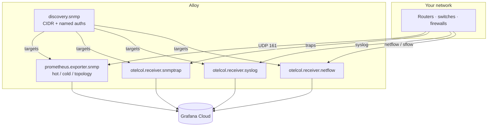

# Architecture

[← README](../README.md)

One Alloy process is the collector. There is no ktranslate sidecar.

## Alloy image

Stock `grafana/alloy` already has `prometheus.exporter.snmp` and `otelcol.receiver.syslog`. Until upstream merges:

| Component | Status |
|-----------|--------|
| `discovery.snmp` | [snmp-sd](https://github.com/Mesverrum/snmp-sd) library + Alloy wrapper on [Mesverrum/alloy](https://github.com/Mesverrum/alloy) `network-snmp` |
| `otelcol.receiver.snmptrap` | Fork — looks like an otelcol receiver; waiting on OpenTelemetry ([alloy#440](https://github.com/grafana/alloy/issues/440)) |
| `otelcol.receiver.netflow` | Experimental wrap of contrib ([alloy#6304](https://github.com/grafana/alloy/issues/6304)) |

Build the fork (`Dockerfile.network-src` / `ALLOY_NETWORK_FROM_SOURCE=1`) and set `ALLOY_IMAGE` in `.env`. The MIB / fingerprinter library is **in the image**, not this repo.

## Scrape tiers

Discovery assigns modules per `sysObjectID`. Typical split:

| Tier | Interval | What |
|------|----------|------|
| **hot** | 60s | Identity, CPU/mem, IF-MIB octets / oper / speed |
| **cold** | 5m | Names, packet counters, errors, discards, IP inventory when the device speaks IP-MIB |
| **topology** | 15m | LLDP / BGP-class (optional) |

`snmp_group` is the discovery **group name** (`hq` above) — a site/credential bucket, not a CMDB.

## Identity (not a second catalog)

`discovery.snmp` emits `address` + `device_name` + `snmp_group`. Pass that target list into trap, syslog, and netflow `targets =`. A packet from a polled IP gets the same `device_name`.

That is enough for “which router sent this.” Conversation endpoints (`src_device` / `dst_device`) only resolve if that IP is also in the target list. Servers usually are not. Use IPs or reverse-DNS (`src_host` / `dst_host`) for 5-tuples. Optional extra aliases are operator YAML in Fleet — default empty.

## Metric / log names

| Signal | What to query |
|--------|----------------|
| SNMP | `snmp_CPU`, `snmp_ifHCInOctets`, `snmp_tBgpPeerNgConnState`, … (`job="alloy-snmp"`) |
| Flow | `alloy_network_io_by_flow_bytes{integration="alloy-netflow"}` — **use `rate()`** (cumulative Sum) |
| Traps | Loki `{service_name="alloy-snmptrap"}` |
| Syslog | Loki `{service_name="alloy-syslog"}` |

There is no `kentik_snmp_*` on this path.
