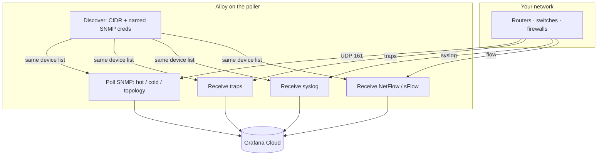

# How the collector is wired

[← README](../README.md)

One Alloy process on the poller does discovery, polling, traps, syslog, and flow. Nothing else has to sit in front of Grafana Cloud.

## What must be installed

The default is Docker Compose on a Linux poller ([README](../README.md#quickstart)) using the public `ghcr.io/mesverrum/alloy-network` image (personal GHCR, not `grafana/alloy`). Fingerprinters are whatever the tag baked in. Optional: compile, or copy the binary onto a host systemd service — [install-alloy.md](install-alloy.md).

The large SNMP “which OIDs for which vendor” library is **inside that build** (`/etc/alloy/snmp-network.yml`). Do not paste it into Fleet.

## How often Alloy polls (hot / cold / topology)

After discovery sees a `sysObjectID`, it assigns vendor modules. Polling is split so you do not walk everything every minute (same idea as fast vs slow NMS cycles):

| Name | Typical interval | What you get |
|------|------------------|--------------|
| **hot** | 60 seconds | Device identity, CPU / memory, interface octets, oper status, speed |
| **cold** | 5 minutes | Interface names, packet counters, errors, discards, IP table if the device speaks IP-MIB |
| **topology** | 15 minutes | LLDP / BGP-class (optional) |

`snmp_group` is the **group name you typed** in config (`hq`, `branch`). Use it as a site or credential bucket. Put CMDB site / role in NetBox or similar, not as a second Prometheus label unless you have a reason.

Reskinned Linux appliances often share a generic sysObjectID. Fingerprinting cannot tell them apart — pin that management IP with an `override` block (ktranslate’s “force this profile”). See [overrides.md](overrides.md).

## Device names on traps, syslog, and flow

Discovery produces a list: management IP + `device_name` + `snmp_group`. Traps, syslog, and flow use that same list. A packet from a polled IP gets the same name as the SNMP series.

That answers “which router sent this.” Flow *conversations* (client ↔ server) only get a friendly `src_device` / `dst_device` if that IP is also in the SNMP list. Most servers are not. You will see IPs, or reverse-DNS names when that is enabled. That is normal.

## What the dashboards query

Import the boards in [dashboards.md](dashboards.md). If you need the raw names:

| Signal | Metric / log |
|--------|-----------------|
| SNMP | Prometheus: `snmp_CPU`, `snmp_ifHCInOctets`, … filter `job="alloy-snmp"` |
| Flow | Prometheus: `alloy_network_io_by_flow_bytes{integration="alloy-netflow"}` — wrap in `rate(…[5m])` |
| Traps | Loki: `{service_name="alloy-snmptrap"}` |
| Syslog | Loki: `{service_name="alloy-syslog"}` |

The sample River self-scrapes Alloy so Health can show `discovery_snmp_*{job="alloy"}`. Flow boards need a device exporting to `:2055` / `:6344`. Interface util / error % need [recording rules](recording-rules.md).

Paste-ready examples: [grafana.md](grafana.md). Why `rate()` and not “divide by 60”: these are normal increasing counters, not 60-second delta gauges.

## More than one poller

One process per management domain is the normal next step. Same CIDR on two hosts without a shard double-walks every device. UDP (traps / syslog / flow) still aims at one IP. Details: [scalability.md](scalability.md), [availability.md](availability.md).
