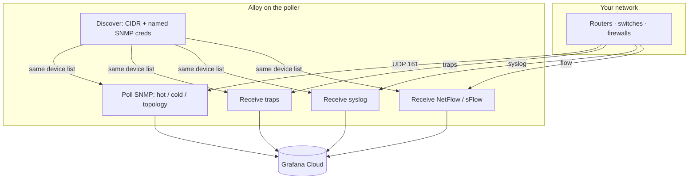

# How the collector is wired

[← README](../README.md)

One Alloy process on the poller does discovery, polling, traps, syslog, and flow. Nothing else has to sit in front of Grafana Cloud.

## What must be installed

The official Linux package gives you the service. This guide’s discovery / trap / flow config needs the **network** build on top of that. Follow [install-alloy.md](install-alloy.md) — you do not need to read GitHub issues to finish install.

The large SNMP “which OIDs for which vendor” library is **inside that build** (`/etc/alloy/snmp-network.yml`). Do not paste it into Fleet.

## How often Alloy polls (hot / cold / topology)

After discovery sees a `sysObjectID`, it assigns vendor modules. Polling is split so you do not walk everything every minute (same idea as fast vs slow NMS cycles):

| Name | Typical interval | What you get |
|------|------------------|--------------|
| **hot** | 60 seconds | Device identity, CPU / memory, interface octets, oper status, speed |
| **cold** | 5 minutes | Interface names, packet counters, errors, discards, IP table if the device speaks IP-MIB |
| **topology** | 15 minutes | LLDP / BGP-class (optional) |

`snmp_group` is the **group name you typed** in config (`hq`, `branch`). Use it as a site or credential bucket. Put CMDB site / role in NetBox or similar, not as a second Prometheus label unless you have a reason.

## Device names on traps, syslog, and flow

Discovery produces a list: management IP + `device_name` + `snmp_group`. Traps, syslog, and flow use that same list. A packet from a polled IP gets the same name as the SNMP series.

That answers “which router sent this.” Flow *conversations* (client ↔ server) only get a friendly `src_device` / `dst_device` if that IP is also in the SNMP list. Most servers are not. You will see IPs, or reverse-DNS names when that is enabled. That is normal.

## What to query in Grafana

| Signal | In Explore, use |
|--------|-----------------|
| SNMP | Prometheus: `snmp_CPU`, `snmp_ifHCInOctets`, … filter `job="alloy-snmp"` |
| Flow | Prometheus: `alloy_network_io_by_flow_bytes{integration="alloy-netflow"}` — wrap in `rate(…[5m])` |
| Traps | Loki: `{service_name="alloy-snmptrap"}` |
| Syslog | Loki: `{service_name="alloy-syslog"}` |

Paste-ready examples: [grafana.md](grafana.md). Why `rate()` and not “divide by 60”: these are normal increasing counters, not 60-second delta gauges.
